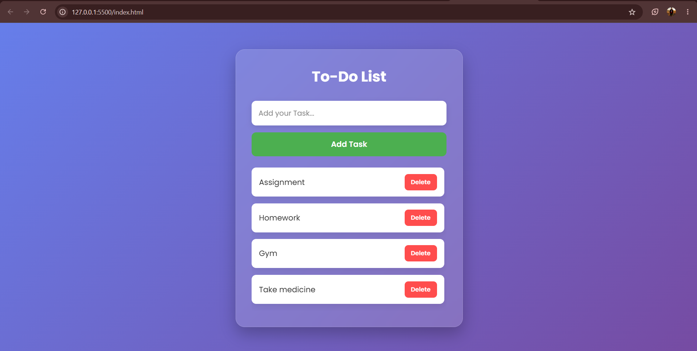

# ✅ Modern To-Do List

A modern and responsive **To-Do List Web Application** built using **HTML5, CSS3, and JavaScript**. The application allows users to add and delete tasks dynamically through a clean and intuitive interface, featuring a modern glassmorphism-inspired design and a fully responsive layout.

---

## 🌐 Live Demo

🚀 **View the live project here:**

### 🔗 https://prashantt05.github.io/prashantt05-synent-task5-todoapp-prashant/

[](https://prashantt05.github.io/prashantt05-synent-task5-todoapp-prashant/)

---

# 📸 Project Preview



---

# ✨ Features

- ✅ Add new tasks instantly
- 🗑️ Delete tasks with a single click
- 🎨 Modern Glassmorphism-inspired UI
- 📱 Fully Responsive Design
- ⚡ Fast and lightweight
- 💻 Dynamic DOM manipulation using JavaScript
- 🎯 Clean and minimal interface
- 🎉 Smooth hover animations

---

# 🛠️ Technologies Used

- HTML5
- CSS3
- JavaScript (ES6)

---

# 📂 Project Structure

```text
prashantt05-synent-task5-todoapp-prashant/
│
├── index.html
├── style.css
├── script.js
├── README.md
└── assets/
    └── preview.png
```

---

# 🎨 UI Components

## 📝 Task Input

- Clean and responsive input field
- Easy task entry
- Placeholder guidance for users

## ➕ Add Task Button

- Dynamically adds new tasks
- Interactive hover effects
- Modern button styling

## 📋 Task List

- Displays all added tasks
- Responsive layout
- Clean card-style appearance

## 🗑️ Delete Button

- Removes tasks instantly
- Hover animation
- Simple and intuitive user experience

## 🌈 Background

- Beautiful purple-blue gradient
- Glassmorphism-inspired container
- Modern, clean visual design

---

# 📱 Responsive Design

Optimized for:

- 💻 Desktop
- 💼 Laptop
- 📱 Mobile
- 📟 Tablet

---

# 🚀 Getting Started

### Clone the repository

```bash
git clone https://github.com/prashantt05/prashantt05-synent-task5-todoapp-prashant.git
```

### Navigate to the project

```bash
cd prashantt05-synent-task5-todoapp-prashant
```

### Run the project

Open **index.html** in your preferred web browser or use the **Live Server** extension in Visual Studio Code.

---

# ⚙️ How It Works

1. Enter a task in the input field.
2. Click the **Add Task** button.
3. The task is instantly added to the list.
4. Click the **Delete** button to remove a task.

---

# 🎯 Future Improvements

- ✔️ Mark tasks as completed
- ✏️ Edit existing tasks
- 💾 Store tasks using Local Storage
- 🌙 Dark/Light Mode
- 📅 Add due dates
- 🔍 Search tasks
- 🏷️ Categorize tasks
- 🎯 Drag-and-drop task ordering

---

# 📄 License

This project is licensed under the **MIT License**.

---

# 👨‍💻 Author

**Prashant Rajput**

- 💼 MERN Stack Developer
- 🤖 AI & ML Enthusiast
- 🎓 B.Tech CSE (AIML)

### 📫 Connect with Me

- **GitHub:** https://github.com/prashantt05
- **LinkedIn:** https://www.linkedin.com/in/prashant-rajput-838291329/
- **Email:** prashantt9405@gmail.com

---

⭐ **If you found this project helpful, consider giving it a Star on GitHub!**
